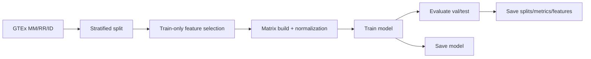

# SpliceVault

SpliceVault trains tissue classifiers from RNA-seq splice-junction data (recount3 GTEx v8).

## Repository layout

```text
SpliceVault/
├── splicevault/                 # Python package (PSI/signatures/classify/viz/CLI)
├── scripts/
│   ├── data/                    # Download helpers
│   └── train/                   # Training pipelines
├── data/
│   ├── raw/                     # Downloaded recount3 files
│   └── processed/               # Features, labels, splits, metrics
├── models/                      # Trained model artifacts
├── tests/
├── notebooks/
├── workflow/
└── .github/workflows/ci.yml
```

## Install

```bash
poetry install
# or
pip install -e .
```

## Quick start

### 1) Use the existing trained model (no retraining required)

```bash
splicevault classify \
  --junctions path/to/sample.junc \
  --model models/splicevault_gtex_v8_tissue_multitissue_model.joblib
```

### 2) Download GTEx junction assets (optional, for reproducing training)

```bash
python3 scripts/data/download_recount3_gtex_v8.py --include jxn_MM,jxn_RR,jxn_ID
```

This pulls MatrixMarket counts (`MM`), junction metadata (`RR`), and sample IDs (`ID`) into:

`data/raw/recount3/gtex_v8/files/<TISSUE>/`

### 3) Train the multi-tissue model (optional)

```bash
PYTHONPATH=. python3 scripts/train/train_gtex_v8_tissue_multitissue.py
```

## How training works

Script: `scripts/train/train_gtex_v8_tissue_multitissue.py`

- Detect tissues with complete `MM/RR/ID` files
- Build stratified `train/val/test` split (`70/15/15`, `random_state=42`)
- Feature selection uses **train split only**:
  - parse junction keys as `chrom:start-end:strand`
  - keep main chromosomes (`chr*`)
  - pick top-variance junctions per tissue (`TOP_PER_TISSUE=200`)
  - union per-tissue sets into one feature space
- Build sample × feature matrix from sparse junction counts
- Normalize per sample: `log1p((x / sum(x_sample)) * 1e6)`
- Train multinomial logistic regression pipeline:
  - median imputation
  - standard scaling
  - logistic regression classifier
- Evaluate on train/val/test (accuracy, macro-F1, per-class report)



## Output files

From the multi-tissue run:

- `models/splicevault_gtex_v8_tissue_multitissue_model.joblib`
- `models/splicevault_gtex_v8_tissue_multitissue_model.h5`
- `data/processed/gtex_v8_tissue_multitissue/junction_features.parquet`
- `data/processed/gtex_v8_tissue_multitissue/junction_labels.csv`
- `data/processed/gtex_v8_tissue_multitissue/splits.json`
- `data/processed/gtex_v8_tissue_multitissue/metrics.json`

## Other training scripts

- `scripts/train/train_gtex_v8_tissue.py` (smaller baseline run)
- `scripts/train/train_gtex_v8_tissue_strict.py` (stricter split/evaluation variant)

## Development

```bash
python3 -m ruff check .
python3 -m pytest -q
```
