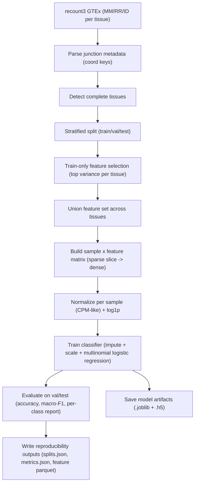

# SpliceVault

SpliceVault is a Python toolkit for tissue and disease classification using **alternative splicing patterns** (junction/PSI-derived features) from RNA-seq, rather than standard gene-expression-only signatures.

## What This Repo Contains

- Core package: `splicevault/`
- CLI: `splicevault.cli`
- GTEx/recount3 data download scripts: `scripts/data/`
- Leak-aware training pipelines: `scripts/train/`
- Workflow scaffold: `workflow/Snakefile`

## Repository Layout

```text
SpliceVault/
├── splicevault/                 # Python package (PSI, signatures, classify, viz, CLI)
├── scripts/
│   ├── data/                    # Data acquisition/downloading helpers
│   └── train/                   # Train/val/test training pipelines
├── data/
│   ├── raw/                     # External raw data (recount3 GTEx files)
│   └── processed/               # Derived feature matrices, splits, metrics
├── models/                      # Trained model artifacts (.joblib + .h5)
├── tests/                       # Pytest suite
├── notebooks/                   # Example notebook
├── workflow/                    # Snakemake scaffold
└── .github/workflows/ci.yml     # CI
```

## Installation

### Poetry (recommended)

```bash
poetry install
```

### Pip

```bash
pip install -e .
```

## Pipeline: End-to-End (Real GTEx Junction Data)

### 1. Download recount3 metadata table

```bash
curl -L --fail -o data/raw/recount3/gtex_v8/recount3_raw_project_files_with_default_annotation.csv \
  https://raw.githubusercontent.com/LieberInstitute/recount3-docs/master/docs/recount3_raw_project_files_with_default_annotation.csv
```

### 2. Download GTEx junction matrices

Use the downloader to fetch junction assets (`MM`, `RR`, `ID`) for GTEx tissues:

```bash
python3 scripts/data/download_recount3_gtex_v8.py --include jxn_MM,jxn_RR,jxn_ID
```

Notes:
- Downloads are resumable (`curl -C -`).
- Files are stored under `data/raw/recount3/gtex_v8/files/<TISSUE>/`.

### 3. Train with leak-aware train/val/test splits

Run the multi-tissue training pipeline:

```bash
PYTHONPATH=. python3 scripts/train/train_realworld_multitissue_noleak.py
```

What this script does:
- Detects tissues with complete `MM/RR/ID` junction files
- Builds stratified `train/val/test` splits
- Selects high-variance junction features using **train split only**
- Trains classifier (`logreg` backend in `splicevault.classify`)
- Evaluates on train/val/test holdouts
- Saves model + split/metrics artifacts

## Model Training Methodology (Technical)

### Data source and modality

- Data source: recount3 GTEx v8 tissue projects (`human`, `data_sources/gtex`)
- Inputs per tissue: junction count matrix (`*.ALL.MM.gz`), junction metadata (`*.ALL.RR.gz`), sample identifiers (`*.ALL.ID.gz`)
- Unit of learning: **sample-level tissue classification** from junction-derived splicing features

### Feature construction

1. Parse junction coordinates from RR metadata as:
   - `chromosome:start-end:strand`
2. Restrict candidate junctions to main chromosomes (`chr*`) for stable genomic signal.
3. Perform variance-based feature selection **within each tissue on the train split only**:
   - compute per-junction variance from sparse matrices
   - keep top `TOP_PER_TISSUE` (currently `200`) junctions per tissue
   - union selected junctions across tissues into a global feature set
4. Build dense sample × feature matrix by slicing selected junction rows from each sparse matrix.
5. Apply per-sample library-size normalization and log transform:
   - `x_norm = log1p((x / sum(x_sample)) * 1e6)`

### Split strategy and leakage controls

- Split strategy: stratified `70/15/15` train/validation/test over all samples (`random_state=42`)
- Leakage control: feature selection is executed **after splitting** and uses only train samples
- Validation/test folds are untouched by both feature ranking and model fitting

### Model and optimization

- Classifier: multinomial logistic regression pipeline (`model_type='logreg'`)
- Preprocessing in classifier pipeline:
  - median imputation for missing values
  - standard scaling
- Training objective: multi-class tissue discrimination from splice-junction signatures

### Evaluation protocol

- Metrics:
  - accuracy
  - macro F1
  - per-class precision/recall/F1 via `classification_report`
- Output artifacts:
  - serialized model (`.joblib`)
  - HDF5 metadata (`.h5`)
  - persisted features, labels, splits, and metrics JSON for reproducibility

### Current large-cohort run

- Multi-tissue run currently includes 10 tissues with complete junction assets:
  - `ADIPOSE_TISSUE`, `BLOOD`, `HEART`, `MUSCLE`, `COLON`, `THYROID`, `LUNG`, `KIDNEY`, `BLADDER`, `CERVIX_UTERI`
- Representative holdout performance from latest run is stored in:
  - `data/processed/realworld_multitissue_noleak/metrics.json`

### Training Pipeline Diagram



## Outputs

After training, artifacts are written to:

- Model bundle: `models/splicevault_realworld_multitissue_model.joblib`
- HDF5 metadata: `models/splicevault_realworld_multitissue_model.h5`
- Feature matrix: `data/processed/realworld_multitissue_noleak/junction_features.parquet`
- Labels: `data/processed/realworld_multitissue_noleak/junction_labels.csv`
- Splits: `data/processed/realworld_multitissue_noleak/splits.json`
- Metrics: `data/processed/realworld_multitissue_noleak/metrics.json`

## Use a Trained Model

Classify from a junction file via CLI:

```bash
splicevault classify \
  --junctions path/to/sample.junc \
  --model models/splicevault_realworld_multitissue_model.joblib
```

Train from an existing matrix/labels pair:

```bash
splicevault train \
  --matrix path/to/signature_matrix.parquet \
  --labels path/to/labels.csv \
  --out models/custom_model.joblib
```

## Reproducibility and Data Hygiene

- `.gitignore` excludes large raw datasets and model artifacts.
- Training scripts use deterministic random seeds for split stability.
- Split-first + train-only feature selection is used to reduce leakage risk.

## Development

```bash
python3 -m ruff check .
python3 -m pytest -q
```

## Current Roadmap

- Expand to more tissues and harder out-of-distribution evaluation
- Add donor-aware and study-aware holdout protocols
- Integrate long-read isoform evidence for v2 signatures
